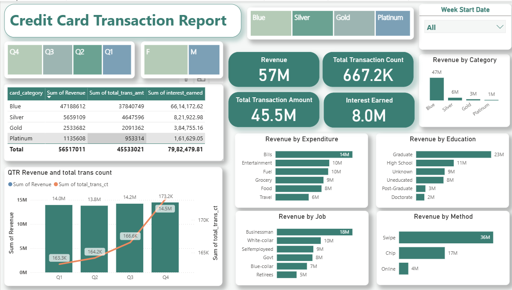
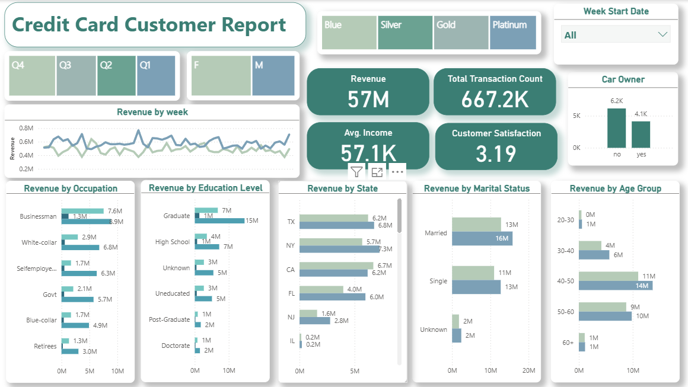

# Credit Card Sales & Revenue Insights Dashboard

This project is designed to provide real-time insights into credit card performance metrics through an interactive Power BI dashboard. The dashboard helps stakeholders monitor and analyze key metrics related to revenue, transactions, and customer demographics on a weekly basis.

## Project Objective

The main objective of this project is to develop a comprehensive **Credit Card Weekly Dashboard** that enables stakeholders to monitor real-time trends and performance metrics. Key insights include revenue, transaction amounts, customer demographics, and regional contributions, all presented in a visually compelling format.

## Features

- **Data Source**: SQL database integrated with CSV files containing transaction and customer details.
- **Data Processing**: Use of SQL queries and DAX calculations for data processing and analysis.
- **Key Insights**: 
  - Revenue trends over time
  - Customer segmentation by age and income groups
  - Transaction breakdown by credit card types and geographical regions
  - Week-over-week (WoW) comparisons

## Insights

- **Revenue Growth**: 28.8% increase
- **Total Transaction Amount & Count**: Increased significantly (exact figures in the report)
- **Customer Growth**: Increased customer count
- **YTD Overview**:
  - Total revenue: $57M
  - Total interest earned: $8M
  - Total transaction amount: $46M
  - Gender-wise contribution: Male $31M, Female $26M
  - Blue and Silver cards account for 93% of transactions
  - Top states: TX, NY, CA (68% contribution)
  - Activation rate: 57.5%
  - Delinquency rate: 6.06%

## Tools & Technologies

- **Power BI**: For developing the dashboard and generating insights
- **SQL**: To import, process, and manage data
- **DAX**: For performing advanced data analysis and calculations in Power BI

## Setup Instructions

1. **SQL Database Setup**:
   - Prepare the CSV files containing transaction and customer data.
   - Create the necessary tables in your SQL environment.
   - Import the CSV files into the SQL tables using the provided SQL queries.
2. **Power BI Integration**:
   - Import the processed data into Power BI.
   - Use the provided DAX queries to generate the necessary insights.
3. **DAX Queries**: 
   - Example queries include age and income group segmentation, weekly revenue calculation, and comparison of current and previous weeks' revenues.
     
    

 
 

 
 

